  

  
  
  
  

---

### About

I'm a Computer Science student at **Univértix** (4th of 8 semesters), vice-president of the **Liga Cadena**, the course's academic league, and I'm aiming at a **back-end** career. Right now I'm in an internship where I work heavily with **AI**: I manage AI agents day to day and build projects around them, learning how to get reliable results out of them instead of just chatting with them.

### Second Brain

My main project is **Second Brain**, a personal knowledge base built on Obsidian and designed to be read and maintained by AI. Every prompt I send to an AI assistant is logged in a private GitHub repository, and what comes out of those conversations (what worked, the pitfalls, the decisions) is distilled into notes by topic. Before answering, the assistant reads those notes, and after answering it updates them, so context never dies in a chat history. A daily routine commits everything to GitHub.

### Studying

At the moment I'm studying object-oriented programming and exception handling in Java, and back-end development with APIs, PostgreSQL and n8n.

### Stack

   
   
  

  

Want to talk? Reach me on <a href="https://www.linkedin.com/in/gabriel-arthur-0378bb379">LinkedIn</a> or by <a href="mailto:l3rieldev@gmail.com">email</a>.

